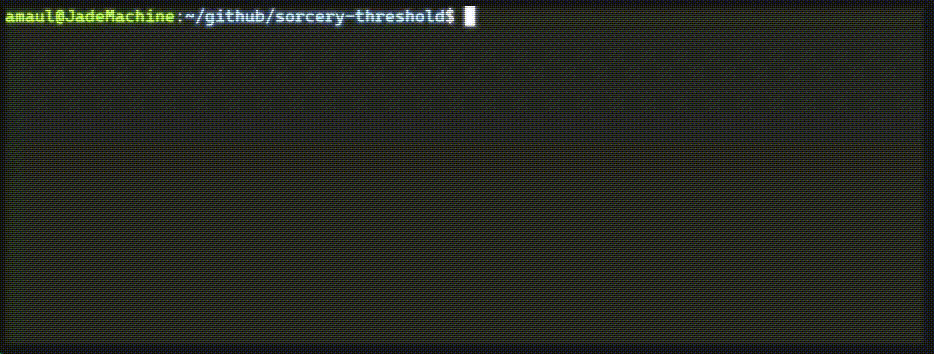

# sorcery-threshold
A node app for determining probabilities of threshold requirements in the game Sorcery: Contested Realm.



## Background
[Sorcery: Contested Realm](https://sorcerytcg.com/) is a trading/collectible card game. The game uses a deck of cards, called Sites, as resources. These resources have attributes correlating to the four alchemical elements: Air, Earth, Fire, and Water. Playable cards (Spells) require a certain 'threshold' of symbols present on sites in order to be played.

When constructing a 30-card Atlas deck, I wondered what the probability was of having a particular configuration of symbols on turn four. This tool provides that information.

## Prerequisites
Node lts/iron 20.18.3

You must provide a list.txt file containing the sites in your deck in the format of:
```
3x Steppe
1x Mirror Realm
4x Hunter's Lodge
```

Feel free to use the included list.txt as a template.

## How To Use
`nvm use`

`npm install`

`node src/index.mjs`

This will run the 'base' version of the tool using the dataset of Beta, Arthurian Legends, Dragonlord, and Gothic sets provided by the Sorcery API.

You will be prompted to provide the criteria in terms of symbols needed. The tool will then perform a [multivariate hypergeometric distribution](https://en.wikipedia.org/wiki/Hypergeometric_distribution#Multivariate_hypergeometric_distribution) calculation to provide the probability of getting that criteria in the same number of cards drawn.

### Flags

`--simulate` will perform a [Monte Carlo Simulation](https://en.wikipedia.org/wiki/Monte_Carlo_method) instead. This is useful to corroborate the results of the MHD calculation. Use the `--iterations` flag to set the number of iterations; default is 10000.

`--drawCount n` flag, when passed in with a number, represents the number of cards to be drawn and used in calculations. Defaults to 3, as that is the default starting hand size.

`--wild` will alter the generated `threshold-data.json` file by swapping blank entries for certain sites with values of `aefw`. This can be useful because certain sites are listed in the official dataset as providing no threshold, when in-game they _do_...under certain circumstances. Valley of Delight, for example, asks the player to choose an element when it comes into play, and then provides that symbol as threshold for the rest of the game. There is a curated list of sites that can be converted from having null threshold values to maximum threshold values by using this flag.

`--forceNew` will re-create the `threshold-data.json` file. Most likely used in conjunction with `--wild`.

`--save` will save the chosen threshold criteria to `./criteria.json` so you don't need to go through the prompt process every time. Simply delete the file when you want to use new values.

## Testing

`npm test` will run `src/tests/integration.test.mjs` as the default behavior. This checks both simulated and derived probability for a static data set.

`npm run testAll` will run a much larger set of tests and take longer to complete.

## Updating

When a new set comes out, download new card data from [Sorcery API](https://api.sorcerytcg.com/). Replace the old sorcery-cards.json file. Manually edit the wild-cards.mjs file with any sites that may conditionally provide all four elements threshold.

